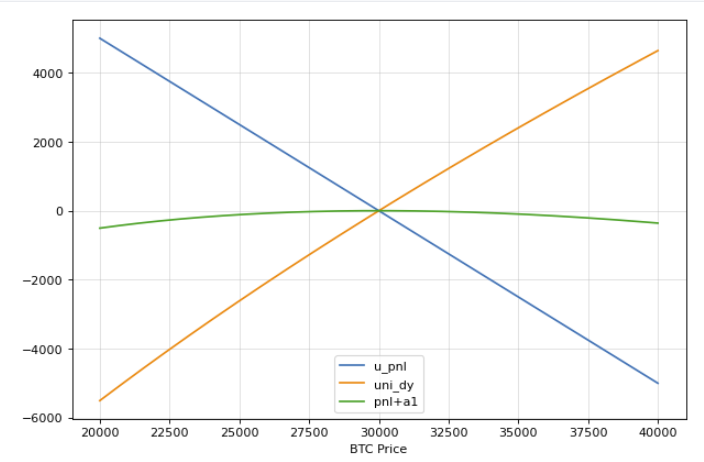

# July 4th

任何币的收益是：

$$
PnL = (amount_t - amount_0) \times price_t
$$

对冲目标不是价值不变，是（潜在的）币数量不变
两种情况有别：

永续合约PnL的计算：https://huobiglobal.zendesk.com/hc/en-us/articles/900000728106-What-is-calculation-rule-for-closing-profit-after-settlement-

---

## 币本位合约对冲

1. 使用和池子比例相同的合约数量
2. long头寸

### case1

1. 假设GLP池含有（30000\$U + 30000\$BTC) , 此时BTC价格为\$30000, GLP价格为1\$
2. BTC价格变为\$31000 , GLP池子即(30000\$U + 31000\$BTC) , GLP 价格变为$61000/60000 = 1.017\

$$

$$

1. 显然，我一开始如果存入1BTC，换得30000GLP，最终只能换出

$$
\frac{30000 * 1.0167}{31000} = 0.9838(BTC)
$$

购买GLP和出售GLP后，BTC数量减少了。

1. 如果我使用了币本位合约，我一开始用0.5个BTC的long合约对冲，此时我的合约PnL是

$$
(1/30000 - 1/ 31000) \times 0.5 \times 30000 = 0.0161(BTC)
$$

正好弥补上一步中BTC的亏损，而保证金占用(全额)则为0.5个BTC

### case2

1. 仍保持前GLP池，假设BTC价格跌到\$29000，此时GLP池子是（\$30000 + \$29000）GLP价格为\$59000/60000 = 0.9833\$
2. 我一开始存入了1BTC，得到30000GLP，最终换出的BTC为

$$
\frac{30000\times 0.9833}{29000} = 1.0172(BTC)
$$

1. 如果我使用了币本位合约，我一开始持有0.5个BTC的long头寸，此时我的合约PnL为

$$
（1/30000 - 1/29000）\times 0.5 \times 30000 = -0.0172(BTC)
$$

---

## U本位合约

1. 使用和池子比例相同的合约数量
2. short头寸

### case1

1. 同样假设5050的比例，BTC价格有\$30000涨到\$31000，此时GLP池子是（\$30000 + \$31000）GLP价格为\$61000/60000 = 1.0167\$
2. 我一开始存入30000usdt，得到30000GLP，最终换出的usdt为

$$
30000\times 1.0167= 30500(usdt)
$$

3. 如果我使用了U本位合约，我一开始持有$15000(相当于0.5个btc)的short头寸，此时我的合约PnL为

$$
(30000-31000) * 0.5 = -500(usdt)
$$

### case2

1. 同样假设5050的比例，BTC价格有\$30000跌到\$29000，此时GLP池子是（\$30000 + \$29000）GLP价格为\$59000/60000 = 0.9833\$
2. 我一开始存入30000usdt，得到30000GLP，最终换出的usdt为

$$
30000\times 0.9833 = 29500(usdt)
$$

3. 如果我使用了U本位合约，我一开始持有$15000(相当于0.5个btc)的short头寸，此时我的合约PnL为

$$
(30000 - 29000) * 0.5 = 500(usdt)
$$

---

结论

* 用币买glp，此时需要保证币数量不变，需要使用币本位合约。
* 用u买glp，此时需要用u本位合约。
* 现货的case并不能保证币数量不变，只能保证价值不变。
  * 举例，借来0.5btc价值3w卖出，价格上涨到31000时，PnL = - 500，而gmx方面的btc只剩下0.9838。但是因为0.9838 * 31000 = 30500，所以总价值没变，但是btc少了。
  * 从另一个思路看：要归还0.5个btc需要15500去买btc，最终剩下15000 + 30500 - 15500 = 30000元。即btc减少，总价值没变。

## show case:

- GLP 持仓个数；
- GLP价格；eth价格；
- 实时的可换回的eth数量
- 合约PnL，以u或eth计；
- dividend

failed examples：
umami必须要做空，做空要不断平衡，平衡手续费umami用的第三方平台开销很大。

gamma neutral

# July 6th

Uni回测报告撰写中发现数据源不干净，换了回测区间重新测量，等回测结果后填入报告即可。

****既然Uni的对冲目标是eth数量稳定，那么用币本位合约，当价格上涨时Uni的eth减少，而合约同时获得正收益（eth结算）控制对冲比率是否可以更好完成任务？？****

## 合约盈亏和UniLP的dx模拟

当币价偏离初始值时，UniLP的币数量会变化，而合约也会有实时的PnL，模拟如下：

### case1 币本位合约

### case2 u本位合约

# todo

## GMX

* 多种对冲方式，现货 期货 多币种权重变化 ； 风险控制（仓位
* 等待同步。。。

## Uni

* 现货，完善模型，增加参数或者丰富模型，参考现有案例
* 期货，换成期货对冲，加上仓位控制

  * **Nomination 如何确定？**

  1. 按照爆仓和remove对应
  2. 不希望爆仓。
* 期权，调研（看docs）

---

# July 11th

## Uni -hanliang

期货对冲：

1. 期货对冲的思路和现货有区别
2. 希望两个币的数量都稳定，价格上升时，eth减少&usdt增加，希望有一个产品能够在价格上升时给我eth和拿走usdt。
3. 币本位long + u本位short。Nomination和加入的区间与资金量关联。比如：作为LP提供了25eth，区间为3%，那么当价格浮动3%时，合约的pnl应为±25eth。（margin太多or倍数太高），因为UniV3Lp天然有杠杆，增加margin不能解决问题。
   * 扩大Uni区间

# 损益分析

Uniswap的币变动由以下公式给出：

$$
dx = liq \times (\frac{1}{\sqrt{p_1}} - \frac{1}{\sqrt{p_0}})
$$

同时，合约的损益为：

$$
PnL = (\frac{1}{p_0} - \frac{1}{p_1}) * n_{value}
$$

$n_{value}$ 是合约名义价值，即当杠杆为2x，nomination为1000usdt时，合约实际的名义价值为2 * 1000 usdt。

因此要使得合约的损益对冲，需要满足：

$$
totalPnL = Pnl + dx = liq \times (\frac{1}{\sqrt{p_1}} - \frac{1}{\sqrt{p_0}}) + (\frac{1}{p_0} - \frac{1}{p_1}) * n_{value}
$$

**选取合适的$n_{value}$使得$totalPnL$方差最小.**

report：

* 对冲原理 ：合约逻辑，数理模型
* 回测结果，case分析，优化

# July 4th

任何币的收益是：

$$
PnL = (amount_t - amount_0) \times price_t
$$

对冲目标不是价值不变，是（潜在的）币数量不变
两种情况有别：

永续合约PnL的计算：https://huobiglobal.zendesk.com/hc/en-us/articles/900000728106-What-is-calculation-rule-for-closing-profit-after-settlement-

---

## 币本位合约对冲

1. 使用和池子比例相同的合约数量
2. long头寸

### case1

1. 假设GLP池含有（30000\$U + 30000\$BTC) , 此时BTC价格为\$30000, GLP价格为1\$
2. BTC价格变为\$31000 , GLP池子即(30000\$U + 31000\$BTC) , GLP 价格变为$61000/60000 = 1.017\

$$

$$

1. 显然，我一开始如果存入1BTC，换得30000GLP，最终只能换出

$$
\frac{30000 * 1.0167}{31000} = 0.9838(BTC)
$$

购买GLP和出售GLP后，BTC数量减少了。

1. 如果我使用了币本位合约，我一开始用0.5个BTC的long合约对冲，此时我的合约PnL是

$$
(1/30000 - 1/ 31000) \times 0.5 \times 30000 = 0.0161(BTC)
$$

正好弥补上一步中BTC的亏损，而保证金占用(全额)则为0.5个BTC

### case2

1. 仍保持前GLP池，假设BTC价格跌到\$29000，此时GLP池子是（\$30000 + \$29000）GLP价格为\$59000/60000 = 0.9833\$
2. 我一开始存入了1BTC，得到30000GLP，最终换出的BTC为

$$
\frac{30000\times 0.9833}{29000} = 1.0172(BTC)
$$

1. 如果我使用了币本位合约，我一开始持有0.5个BTC的long头寸，此时我的合约PnL为

$$
（1/30000 - 1/29000）\times 0.5 \times 30000 = -0.0172(BTC)
$$

---

## U本位合约

1. 使用和池子比例相同的合约数量
2. short头寸

### case1

1. 同样假设5050的比例，BTC价格有\$30000涨到\$31000，此时GLP池子是（\$30000 + \$31000）GLP价格为\$61000/60000 = 1.0167\$
2. 我一开始存入30000usdt，得到30000GLP，最终换出的usdt为

$$
30000\times 1.0167= 30500(usdt)
$$

3. 如果我使用了U本位合约，我一开始持有$15000(相当于0.5个btc)的short头寸，此时我的合约PnL为

$$
(30000-31000) * 0.5 = -500(usdt)
$$

### case2

1. 同样假设5050的比例，BTC价格有\$30000跌到\$29000，此时GLP池子是（\$30000 + \$29000）GLP价格为\$59000/60000 = 0.9833\$
2. 我一开始存入30000usdt，得到30000GLP，最终换出的usdt为

$$
30000\times 0.9833 = 29500(usdt)
$$

3. 如果我使用了U本位合约，我一开始持有$15000(相当于0.5个btc)的short头寸，此时我的合约PnL为

$$
(30000 - 29000) * 0.5 = 500(usdt)
$$

---

结论

* 用币买glp，此时需要保证币数量不变，需要使用币本位合约。
* 用u买glp，此时需要用u本位合约。
* 现货的case并不能保证币数量不变，只能保证价值不变。
  * 举例，借来0.5btc价值3w卖出，价格上涨到31000时，PnL = - 500，而gmx方面的btc只剩下0.9838。但是因为0.9838 * 31000 = 30500，所以总价值没变，但是btc少了。
  * 从另一个思路看：要归还0.5个btc需要15500去买btc，最终剩下15000 + 30500 - 15500 = 30000元。即btc减少，总价值没变。

## show case:

- GLP 持仓个数；
- GLP价格；eth价格；
- 实时的可换回的eth数量
- 合约PnL，以u或eth计；
- dividend

failed examples：
umami必须要做空，做空要不断平衡，平衡手续费umami用的第三方平台开销很大。

gamma neutral

# July 6th

Uni回测报告撰写中发现数据源不干净，换了回测区间重新测量，等回测结果后填入报告即可。

****既然Uni的对冲目标是eth数量稳定，那么用币本位合约，当价格上涨时Uni的eth减少，而合约同时获得正收益（eth结算）控制对冲比率是否可以更好完成任务？？****

## 合约盈亏和UniLP的dx模拟

当币价偏离初始值时，UniLP的币数量会变化，而合约也会有实时的PnL，模拟如下：

### case1 币本位合约

### case2 u本位合约

# todo

## GMX

* 多种对冲方式，现货 期货 多币种权重变化 ； 风险控制（仓位
* 等待同步。。。

## Uni

* 现货，完善模型，增加参数或者丰富模型，参考现有案例
* 期货，换成期货对冲，加上仓位控制

  * **Nomination 如何确定？**

  1. 按照爆仓和remove对应
  2. 不希望爆仓。
* 期权，调研（看docs）

---

# July 11th

## Uni -hanliang

期货对冲：

1. 期货对冲的思路和现货有区别
2. 希望两个币的数量都稳定，价格上升时，eth减少&usdt增加，希望有一个产品能够在价格上升时给我eth和拿走usdt。
3. 币本位long + u本位short。Nomination和加入的区间与资金量关联。比如：作为LP提供了25eth，区间为3%，那么当价格浮动3%时，合约的pnl应为±25eth。（margin太多or倍数太高），因为UniV3Lp天然有杠杆，增加margin不能解决问题。
   * 扩大Uni区间

# 损益分析

Uniswap的币变动由以下公式给出：

$$
dx = liq \times (\frac{1}{\sqrt{p_1}} - \frac{1}{\sqrt{p_0}})
$$

同时，合约的损益为：

$$
PnL = (\frac{1}{p_0} - \frac{1}{p_1}) * n_{value}
$$

$n_{value}$ 是合约名义价值，即当杠杆为2x，nomination为1000usdt时，合约实际的名义价值为2 * 1000 usdt。

因此要使得合约的损益对冲，需要满足：

$$
totalPnL = Pnl + dx = liq \times (\frac{1}{\sqrt{p_1}} - \frac{1}{\sqrt{p_0}}) + (\frac{1}{p_0} - \frac{1}{p_1}) * n_{value}
$$

**选取合适的$n_{value}$使得$totalPnL$方差最小.**

report：

* 对冲原理 ：合约逻辑，数理模型
* 回测结果，case分析，优化

BI CONTRACTS

$$
a_0 = liq\sqrt{p_0} / 2
$$

U CONTRACTS

$$
a_1 = a_0
$$

**如果我们忽略Divident，将UniLP的头寸变化量记为净损益$dx，dy$，可以看到二者的delta是关于$p^{-{0.5}}$的函数，而期货的delta是关于对冲数量$a$的函数。只有动态调整$a$，才能达到delta_hedge的目的。
此时, 可能会涉及到手续费和总损失（dx + dy + bipnl + upnl）之间的抉择。**

eth_usdt_uswap
eth_usd_cswap

## GMX ： fangyu

验证GMX的回测报告。