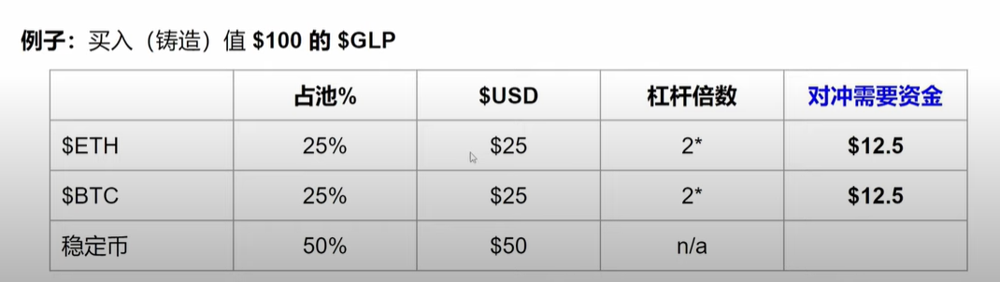
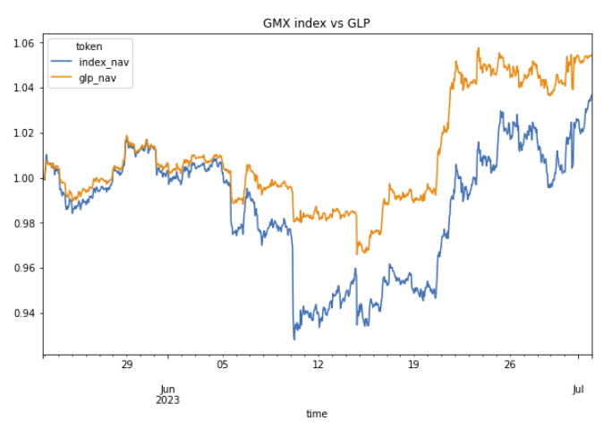

TODO:

* [X] 寻找每次remove的时候，相对bgn_position的rx，ry变动量。
* [X] 统计每次remove的时候，cex的价格（dex价格已在结果中）
* [ ] 因为dex现在是一分钟个位数笔swap，肯定是当仓位有变化且价格有变化时才操作cex
* [X] 每次remove将多的币卖掉

### dynamic_hedging

* [ ] 加入self.delta_x, self.delta_y
* [ ] 设定delta_x 比例
* [ ] 超过比例，输出[tp,delta_x,delta_y,IL]

simulation:

是不是应该每次投入固定数量的[x,y], 会更方便对比不同pool的结果。

> ```python
> import pickle
> pickle.dump(tjs, open("backtest_details/tjs.txt", 'wb'))  # 序列化
> opentjs = pickle.load(open('backtest_details/tjs.txt', 'rb'))  # 反序列化
>
> ```

---

# **5-30**

maker and taker : https://www.528btc.com/tk/58402.html

结果：

* Total Value线
* 收益线

细化每一次对冲。

1、由价格区间的宽度保证add/remove的次数在3 per week。

2、每一次交易都要判断当前价格。

* 价格上涨是卖便宜了，要在价格即将突破的时候买回。
* 价格下降是买贵了，要在价格即将突破时卖出。

3、当cex价格合理时，**挂maker单并等待**   当cex价格过高时，挂taker单    (?????)

4、delta清空之后，重新累计delta，怎么累计？（重写swap)

---

# **5-31**

老A： ~~不是在CEX上反向交易，而是当价格上涨时，我们已经低价卖出了一堆币，为了提高平均卖价在cex挂更高的卖单，将卖价保护在中间。~~

最终方案（可能是）：

* 突破的时候我们在cex买回来，可以以更高的价格买。

或者换一种思路：

* 临时损失是由 价格变动 和 持仓数量XY共同引起的，保证总持仓数量不变，那么就没有il，因为一开始有多少X，结束就有多少X。
* 当X变动超过阈值时，在cex调平
* 最终结算时，只计算

  * $$
    gain\begin{cases}
    divX\\
    divY
    \end{cases}
    \\
    loss\begin{cases}
    hedge\ cost\\
    compoFee\\
    gasFee

    \end{cases}
    $$

基于该方案，我以delta_X <= 50为条件设计实验，对5.22日一整日（UTC0）回测，由于价格区间较大，这天只发生了一次add和remove。

其中，

* divX + Y = 22.388105583389205
* 对冲了7次，总共花费14.17u
* compoFee : 0.09623148365099485
* gas: 2次 = 2u

| ex  | rx     | ry      |
| --- | ------ | ------- |
| CEX | 158.9  | -2327.5 |
| dex | -171.4 | 2489.0  |

这时候il为-22u，比分红大。这是因为div是累加的，而il被限制在一定范围，延长pool的时间，或许能够cover。但是当市场单边，没有累积到足够的交易量时，分红就会远小于il导致亏损。

当然，可以控制delta_X的量，这使得最大的il更小。

## 单边盈利，震荡亏损

每次对冲相当于固定了当时的IL，并重新计算IL。因此当市场反复震荡时，IL路径较长导致对冲收效甚微，过犹不及。

要是能预测市场会震荡........

---

# 6.1

早上优化了回测的部分函数, 提高回测的速度.

[火币研究院：万字剖析AMM做市无常损失对冲和损益及期权对冲_腾讯新闻 (qq.com)](https://new.qq.com/rain/a/20200928A0H52T00)

il实际上是套利者的利润，由于AMM机制，pool的价格只能靠交易驱动，和外部脱钩，当价差到达一定值时，我们能防止被套利者套走吗?

DODO PMM 预言机

结论：

1、可以控制delta在一定值以内。

2、成本不一定能小于IL，也不一定能小于gain，数据依赖。

回测结果

unsolved problems:

* 理论来讲，价格相同的点，il应该是相同的。但是目前的**统计方法下**这个结论并不成立。

1. v3是成立的。
2. tj真的成立吗

* 按照固定量对冲，是消除了多的敞口，而不是无常损失，注意一种情况，在价格保持activeP但是出现了一系列的买，我们的币少了，但是无常损失没有。

---

# June 2nd

重新回测了，将过程量储存下来，画出div累计曲线和delta_xy曲线（过程中x和y的position变化量，每次对冲清空）

delta_x * p + delta_y 是相对还是绝对？

# June 6th

对冲和做市明确分开。

$$
\theta_t = \frac{p_{c,t}}{p_{d,t}}- 1\\
\begin{cases}
\theta_t > \theta_{base} + 0.002 \\
\theta_t < \theta_{base} - 0.002
\end{cases}\\

\theta_{base} = \theta_t
$$

$$
\Delta x = x(p_{c,t},p_{d,t})
$$

# June 7th

要记录在cex提前买的量$\Delta x$, 对冲后 dex价格达到cex的量？ （这不是又变成跟踪cex价格了吗。。。）

---

# June 8th

把对冲开平仓的点在价格线上标清楚。做case study.

## 对冲亏损原因：在一段平稳的行情中，cex的bid和ask包含了dex，这时候不应该做操作，但是原方案根据平均价p_c可能会做操作

1.当bids突然往下突破，我们会卖，但是当bids马上返回时，只能以asks买。asks在这期间没有变化，导致亏了一个盘口价。


  改进方向：

> * 当我们判断的时候，不应该用均价判断，只有当bids > dex ， 或者asks < dex的时候，才可能被套利。
> * 当用bid或ask作为基准时，在单边下跌行情中（single case)，能够将无常损失从-269降低到-60左右；
> * theta变大可以减小损失

  

---

2.亏损原因2：

> * 突变cex行情导致被欺骗，实际上dex价格并未移动，而我们付出了盘口价差,甚至付出了一个波峰行情。cex震荡剧烈，dex不变的时候，不断在cex买卖导致我们付出了盘口价差。
> * 快速的上涨，导致cex没跟上，我们一直买。


Friday todo:

1. 一月回测；
2. 大回测，分析小的case

# June 9th

放大到一月 实现

> [1] add and remove `<br>`
> [2] 数据分段读取。`<br>`
> [3] 每个pool加入固定的amount(liq)，前一个pool如何处理 `<br>`
> [4] 数据保留维度 ： hedge_records < *divident* <= swaps << cex_tickers (包含关系)`<br>`

tips : 整合后记得reset_index

1. 整合了hedge,maker,plot的结果，延长回测区间
2. 优化了maker的回测算法，防止内存占用过高
3. hedge回测速度提高了五倍

为什么一个pool结束的时候 总敞口不是0 甚至有4eth之多

> case : 一次add和remove中 总敞口达到4u，整体控制在+-5eth，但太大了。
> 

> case : 如何汇总移动流动性池
> 

todo：

1. add_liquidity中，要固定每次加入的liq不变。

---

# June 13rd

 实现remove + add 连接：

> 1. total_ret 固定
> 2. IL cex_ret 固定
> 3. ret 固定
> 4. pool_dx,pool_dy,cumCexX,cumHedgespent,total_dx,total_dy与上一个pool结算时的量相加. 其余需要重新计算.

 add_liq 保持liq不变时, add_rx 和 add_ry都会随价格上下限变化。目思路时保持每次add的总价值不超过但尽量接近self.amount(100_000)，且保证add_y = self.amount/2 或 add_x * p = self.amount/2；

假设两边的X和Y都充足，足够进行任何交易。


***参数越多，能抽象出一段行情的特征就越多。***

寻优过程写完了，正在寻优。

todo :

* [ ] remove的时候多的币要不要对冲 ？ 目前是放着不管了。但是按照下一次add的第一次对冲参考价是dex而非上个pool最后一个hedge的来说，应该要对冲一下的。。。
* [ ] 加入theta2 上下突破概率不等，抑或是上突返回和下突返回的概率不等

---

# June 14

## 版本更新：

1. 添加了remove时的敞口对冲
2. 对比3000和500的pool, 回测框架构建完整了，现在的参数只有$\theta_1 = \theta_2$。

***1日回测 ： 是否要使得收益和cex价格的相关性尽量小？***


从两天回测的相关系数来看，$\{total\_ret_t | dx * P_t + dy\}$和$p\_ask\_cex$的相关性很弱，说明策略收益基本不受价格影响。

分别对0607（下跌）和0612（较为平稳）的两天分析，并没有一个theta能够在两天都取胜，其中0607取theta5收益最高，0612取theta100收益最高。。。

***1周回测 case：***

如果dex价格不变，cex连续下跌时，theta越小动态敞口就会越大，有时候会高达-10eth，这是因为下跌的时候会进行大量卖单，一次大约0.5个eth，连下几次就突破-10eth了


---

## 小结：

回测框架完整了，构建寻优思路。如果用最直接得暴力寻优，得找多个theta和多个行情。

而根据目前几次回测结果看，不同的行情下收益的差别，会比相同行情下不同theta得差别要大得多。因此暴力寻优的结果不具有可比较性。接下来应尝试建立关于$\theta_1,\theta_2$的模型。

---

# June 15th

套利机会存在的时长 -> 价格收敛的平均速度

统计条件概率：cex_dex['p_cex']用平均

添加回测参数：

version1.1 : 减少无效对冲：定义cex价格偏移后回归，而dex基本不动为无效对冲。

1. 设置$\tau_d$，在发现可能被套利后先观察，若给定时间内回归则不对冲，能减少无效对冲，但风险是若没回归则成本增加(基于二者的概率) **示意图：下两个图所示的红色的这笔sell，在tau = 15的时候被避免了**

---

# June 16th

version1.1
修复bug；一周数据回测。

完成27组测试

1. 最近一周，[6.6,6.11],[5.12，5.22]
2. $\theta$ = 5/10/20
3. $\tau_d$ = 3/12/30

---

todo：

1. 增加回测区间 找完整 包含最近七天、大涨大跌、平盘；观察大涨、大跌和平盘的场景表现
2. 加上$\tau_d$ = 0对照组
3. 性能提升 回测速度1周五分钟目标

---

# June 20th

v1.3
修正代码，并对昨天讨论的$pct$参数进行多参数寻优(不含tau)

选取代表性行情

* 【2023041208，2023041508】大涨 （正收益
* 【2023061008，2023061508】 大跌 （0收益，但对冲有效）
* 【2023061508，2023062008】 平稳+19号下跌 （最近五天，正收益）
* 【2023051308, 2023052208】平稳 （太平稳以至于没有触发remove，负收益）

当行情非常平稳时，IL很小，此时任何对冲从结果上看都是多余的。
但是当行情单边上涨或下跌时，对冲有效；跟之前的结果对比来看，在行情导致损失时，加入pct有助于减小损失，但仍未实现稳定正盈利

对冲的cex_ret有一个始终向下的漂移项导致cex_ret小于IL，try to find it.

---

# June 21st

向下的漂移项我认为是由对冲时机滞后导致的，每次发生对冲时，从相对长（20min一格）的时间维度看，总是发生在两个价格都移动之后，此时IL已经发生，而对冲相当于在IL的最高点。

继续参数寻优，设定了4个标志时间段，6个theta，8个pct。

(4,6,8) = 192个组合用时190分钟左右

四个时间段内，表现相对优秀的组合有

$$
(theta,pct) = \begin{cases}(30,10)\\(20,\_)\\(20,30)\end{cases}
$$

但是只有在20230413时总收益为正，其余时间为负（对冲仍有效，只是效果不足）

## 如何解读？

1. 要说明一个参数组最好，那么这个参数组应该在所有时段下都相对好。
2. 要说明一个参数组在某一时段下最好
   * 该时段下ret最大
   * 夏普率（标化收益率）最大
   * 该时段下$ret_a - ret_i,i = 1,2...192,i\neq a$统计显著。 （需要ret_a的多个观测值）; 统计时间段内每小时的收益，生成收益序列

DOING：

1. 0401 ~ today 参数寻优

todo：

每两天划分一次，得到每个param_combination下的收益率时序。

---

# June 25th

1. 写了分段绘图函数，给定时间段输出时间段内的统计结果
2. 如何更科学解读回测结果
   * 收益
   * 标准差
   * 敞口线； IL + hedge线
   * 最大回撤
   * 对冲次数
3. 控制变量发现的规律：theta = 10， pct = 20,25,30的时候逐渐变好

todo：
  由于pct = 30是普遍最好，需要增大pct继续寻优。

---

# June 26th

增加参数表现结果相关性很强，两月期的主要亏损发生在行情剧烈变化（半小时内振幅5~6%，几乎达到remove的上下区间时）。怎么办？

找规律：theta200在控制pct时都能排进收益前三（pct影响不大）；改变pct对收益的影响不如theta

现在用的还是taker100% 0fee吗

---

```python
theta = [[5,5],[10,10],[15,15],[20,20],[25,25],[30,30],[50,50],[75,75],[100,100],[150,150],[200,200]]

pct = [2,5,10,15,20,25,30,40,50,75,10000]
```

GMX:

* TRADE
* GMX: 是另一种代币，可以质押获取分成：Escrowed GMX
  ；Multiplier Points ； ETH / AVAX
* GLP: 是一种代币，注入不同的币有不同的费率，取出时是（任意资产？） 分成：开平仓 + 借款费用 + 加仓费用 GMX：GLP = 3：7
* glp价格变动取决什么影响？用户的盈亏

---

# June 27th

2. 结果解读完成 ： 回测区间较长时，由于对冲的时候损失较为稳定，但是盈利部分受到价格影响大。
3. **对冲挂单方式对总收益的影响很大**，如果要进一步提高收益，可能可以从这方面入手（lstm分类指标可以引用）

* 以theta100 pct30为例，两个月对冲344次，每次数量大约10eth，每次价格提高0.01总收益是+30；而据统计，每次对冲时盘口价差的均值是0.7376：假设每次摆单，则节约成本为2108.94 相当于总收益。
* 以theta5 pct20为例，两个月对冲75843次，每次价格提高0.01则总收益是 +300；而盘口价差均值是0.2539，假设每次摆单，则节约成本为9557.80。
* 收益最差的情况t5p2的情况下，两个月对冲3万次，每次价格0.01则 +222； 按盘口价差均价摆单是12937.67

> 优秀参数的robust还没检验，怎么检验？1.选取其他时间段 2. 随机选取两个月内的较短区间

---

# June 28th

如何计算给定GLP数量和时间下的收益?
fGLP

* fGLP RewardTracker合约是fGLP的ERC20合约，同时负责质押GLP并Mint fGLP。质押GLP可以获得平台手续费，以WETH结算。
  fsGLP
* fsGLP RewardTracker合约是fsGLP的ERC20合约，同时负责质押fGLP并Mint fsGLP。质押fGLP可以获得esGMX Token奖励。

**GLP质押用户领取手续费的时候，fGLP RewardTracker合约会从fGLP RewardDistributor合约获取手续费收入。**

可领取收益 = 用户质押数量 * 质押时长 * 单位质押单位时间的收益率

sGMX
sbGMX
sbfGMX

---

质押：


---

解除质押：


---

Price = MktCap / Supply ; 风险是GLP价格变化 ; MktCap = (Total_value of Asset - PnL)

领取收益


---

Dashboard : https://app.gmx.io/#/dashboard
Stats : https://stats.gmx.io/arbitrum

# June 29th

策略介绍：

1. 持有GLP相当于trader的对手盘，获得手续费的70%。
2. GLP是由5050的稳定币和浮动币构成的指数。
3. GLP的价格波动是损失，需要对冲。

Margin Trade 的数据还没有，先用日频的简单回测。用50-25-25空头对冲。

---

@ tp ：

* GLP_price
* GLP_totol_supply
* GLP_composition
* [GLP_rewardDistributor]

另外一个代币是GLP，就是LP代币，用于表示LP在流动性池里的份额（或者说股权）。用户可以使用任何列入白名单的资产提供流动性，他们收到的不再是稳定币USDG，而是流动性池的股权GLP。如果你存入的资产占总池的1%，那么当总池规模涨了10倍的时候，你就可以用赎回10倍的资产，而且还有手续费的激励。

```GO
type DexGmxDepth struct {
	ReceiveTime           uint64 `json:"tp"` // 接收时间
	BlockNumber           uint64 `json:"bn"`
	BlockTime             uint64 `json:"bt"`
	BaseMinPrice          string `json:"p1"`
	BaseMaxPrice          string `json:"p2"`
	QuoteMinPrice         string `json:"p3"`
	QuoteMaxPrice         string `json:"p4"`
	BaseUsdgAmount        string `json:"u1"`
	BaseUsdgTargetAmount  string `json:"u2"`
	QuoteUsdgAmount       string `json:"u3"`
	QuoteUsdgTargetAmount string `json:"u4"`
	HasDynamicFees        bool   `json:"d"`
	SwapFeeBasisPoints    string `json:"sp"`
	TaxBasisPoints        string `json:"bp"`
	BlockStatus           int32  `json:"bs"`
}
type DexGmxTrade struct {
	ReceiveTime        uint64 `json:"tp"`
	BlockNumber        uint64 `json:"tbn"`
	Hash               string `json:"th"`
	Nonce              uint64 `json:"tn"`
	BlockHash          string `json:"tbh"`
	TransactionIndex   uint64 `json:"tti"`
	From               string `json:"tf"`
	TxTo               string `json:"tt"`
	Value              string `json:"tv"`
	Gas                uint64 `json:"tg"`   //gas limit
	GasPrice           string `json:"tgp"`
	Input              string `json:"ti"`
	To                 string `json:"t"`
	AmountsIn          string `json:"ai"`
	AmountsOut         string `json:"ao"`
	IsSell             bool   `json:"is"`
	AmountOutAfterFees string `json:"af"`
	FeeBasisPoints     string `json:"fb"`
	BlockStatus        int32  `json:"bs"`
}
```

# June 30th

* 可以用API获取交易数据 Margin Trade + Swap + Liquidation
* 可以获取GlP Supply的hourly数据，更高频的暂无
  subgraph:  https://subgraph.satsuma-prod.com/3b2ced13c8d9/gmx/gmx-arbitrum-stats/api

  {
  hourlyGlpStats(
  first: 1000
  orderBy: id
  orderDirection: desc
  where: {id_gte: 0, id_lte: 1801001000}
  subgraphError: allow
  ) {
  id
  aumInUsdg
  glpSupply

  __typename
  }
  }

# July 3rd

Rebalance重新平衡机制：

- no IL
- 动态费率
- 动态composition

ques:

* trader 的PNL 会反应到$GLP吗
  * trader long and win : GLP的美元价值不变，eth价值减小。
  * trader short and win ： GLP的eth价值不变，美元价值减小。
* 


用小时数据回测了, 就目前回测结果来说对冲效果并非很好，因为当glp挣钱时，对冲组合也在挣钱。



todo:

    利用时刻的ETH和BTC比例，调整对冲仓位【my_eth,my_wbtc】

