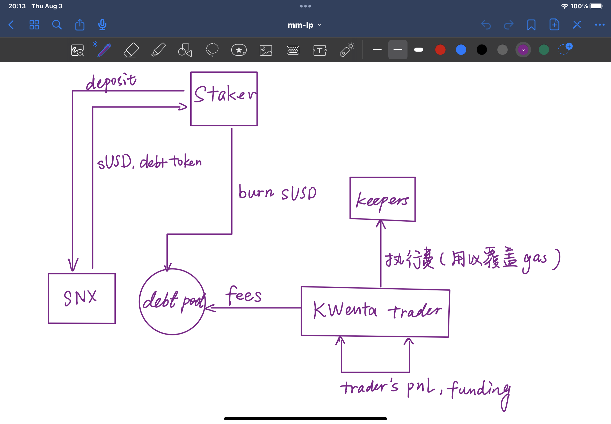

# HMX

https://kjwez9gefn.feishu.cn/docx/WYAmdQdgiorL9BxdAwTcPzNYnBh

1. 用户将资产存入 GMX 的 GLP 并接收 GLP 代币。

2. 用户在 HMX 上质押 GLP 代币，并收到 HLP 代币作为回报。然后，HMX 代表用户质押 GLP 代币，以继续从 GMX 获得 100% 的收益。
3. GLP 金库中的流动性用于为 GMX 的交易者做市，从而以 ETH 的形式从柜台交易和费用中产生利润/损失。
4. 与此同时，HMX 将质押 GLP 的流动性重新抵押给 HMX 交易者的做市商，通过对销交易和费用（借款、开仓/平仓等）累积利润/损失。
5. 然后，HMX 向其交易者收取费用，并从 GMX 收取 ETH 收益，并将其与 esHMX 发行奖励一起重新分配给用户。

---
# global debt pool

---

# Trader

## Profit：

1. 合约盈亏，以sUSD结算，来源是mint/burn
2. 对手funding，每秒计算
3. 奖励计划(为鼓励trader来交易，根据手续费分得，非长期，不重要)

## Loss：

1. 执行费，支付给keeper，动态费用，2\$左右
2. maker/taker手续费 （2bp / 6bp），100%进入debt pool
3. funding，给对手。

---

# staker

## profit：

1. 债务池缩水(sToken总体下跌)
2. trader Loss（2）的手续费(不再发放，而是通过每周burn的形式减少债务, 即在赎回抵押时减少susd得burn量)
3. SNX（抵押物）升值
4. 通胀奖励

## loss：

1. 债务池膨胀（sToken总体上涨）
2. SNX（抵押物）贬值 ：需要使质押价值维持在c-ratio（500%）

---

# Kwenta（integrators）

1. 通过[SIP2002](https://sips.synthetix.io/sips/sip-2002/)提案从synthetix获得SNX奖励。

---
