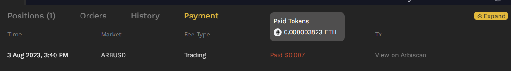
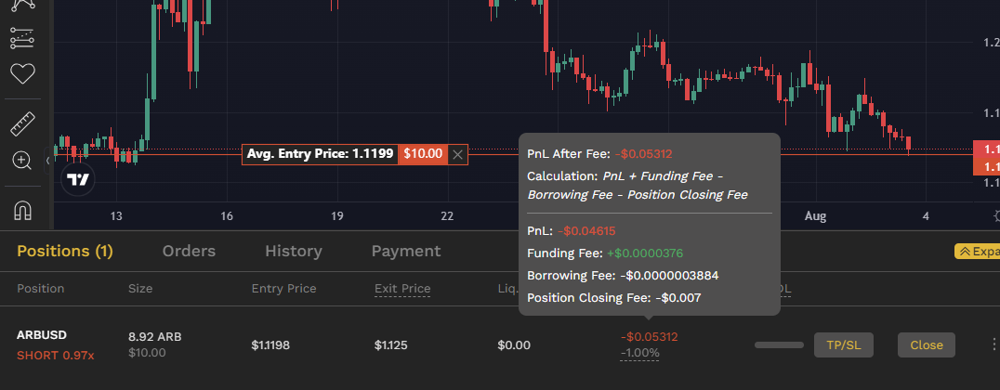
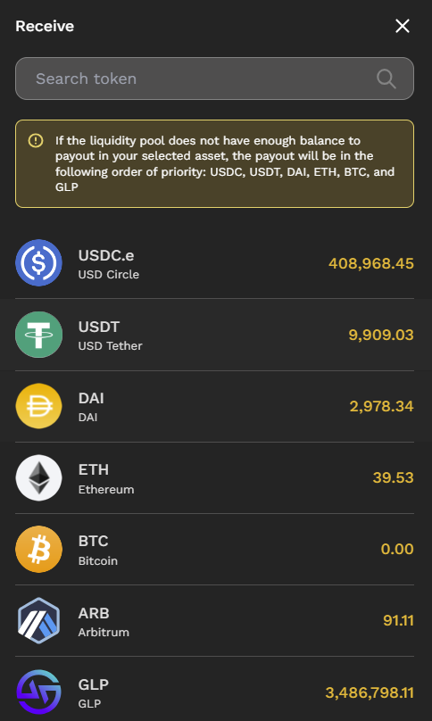

# HMX

https://kjwez9gefn.feishu.cn/docx/WYAmdQdgiorL9BxdAwTcPzNYnBh

1. 用户将资产存入 GMX 的 GLP 并接收 GLP 代币。

2. 用户在 HMX 上质押 GLP 代币，并收到 HLP 代币作为回报。然后，HMX 代表用户质押 GLP 代币，以继续从 GMX 获得 100% 的收益。
3. GLP 金库中的流动性用于为 GMX 的交易者做市，从而以 ETH 的形式从柜台交易和费用中产生利润/损失。
4. 与此同时，HMX 将质押 GLP 的流动性重新抵押给 HMX 交易者的做市商，通过对销交易和费用（借款、开仓/平仓等）累积利润/损失。
5. 然后，HMX 向其交易者收取费用，并从 GMX 收取 ETH 收益，并将其与 esHMX 发行奖励一起重新分配给用户。

---

# LP ：

将GLP存入HLP Vault可以得到：

* 所有ETH奖励均由GMX分配（HMX不收取任何费用）
* HMX 协议（trader 的费用）收入的 65% 以 USDC 支付
* GMX 和 HMX counter trading的利润（或损失）
* esHMX 奖励基于您的 GLP 存款规模和排放率

HLP是一种不稳定币，价值会随着GLP和收到的手续费（USDC.e）变动。

Loss：

由于 HLP 的流动性充当 HMX 和 GMX 交易者的交易对手，因此当交易者作为一个整体因交易而产生损失时，基金就会获利。同样的道理，当交易者赚取利润时，HLP 也会产生损失，使 HLP 储户成为直接吸收损失的一方。

---

# Trader ： 

抵押品管理是 HMX 的主要差异化特征之一。具体来说，HMX是唯一一个基于矿池的去中心化永续交易所，提供全仓保证金管理，同时还允许用户使用多种类型的资产作为抵押品

利润准备金是HLP池中用于支付盈利交易头寸的金额。

费用：

    1. 开平仓交易费用
    2. 借款费用（利润储备 = 头寸 * 保证金比率 * 基于资产类别的系数）
    3. funding fee （dr / dt = k * skew）

---

# q & a
**平台90% 的盈利给到hlp（65%）和hmx（25%）的holder。**

q ：所以trader盈利的钱从哪来？？既然lp只提供glp，那池子里面没有任何资产？

rockman says：

我们的HLP功能与GMX的GLP或gain的gDAI vault类似。

HLP作为一个流动性池，与HMX交易员进行反向交易。如果交易员获胜，HLP的资产将作为利润支付给交易员。如果交易员输了，他们的抵押品将被没收，并作为HLP从柜台交易中获得的利润计入HLP。

然而，HMX和GMX/ gain /等之间的差异是，我们非常重视HLP保护，通过在OI中与我们的机制(如自适应定价和基于速度的融资费用)建立平衡，以便交易员相互对销，HLP可以尽可能保持市场中立，以尽量减少对销交易的潜在损失，并继续从USDC向用户支付的协议产生的费用中赚取收入。

q : 我看到有个profit reserve是用来支付trader的盈利的，请问这个profit reserve里面是什么呢？
a:
我们有流动性合成池。 因此，当市场下跌时，用户可以从我们的合成（USDC 或稳定币）池中获利。
上涨趋势才有对冲 那边也是可以获利
下跌趋势就没有对冲

q : 这个池子是你们提供的是吗，和hlp holder（也就是lp）没关系，但是trader的损益会影响hlp holder，是这样吗？
a : 总体来说trader亏 hlp那边就能赚 类似对赌

---

# 交易费用实例：

---

# HMX代币分配

