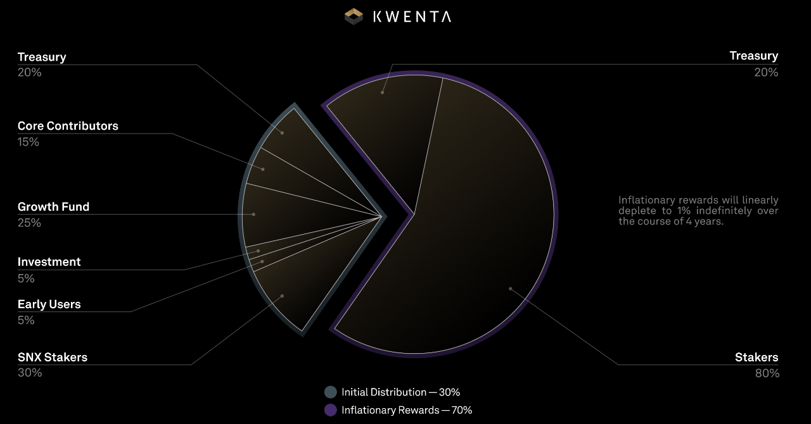
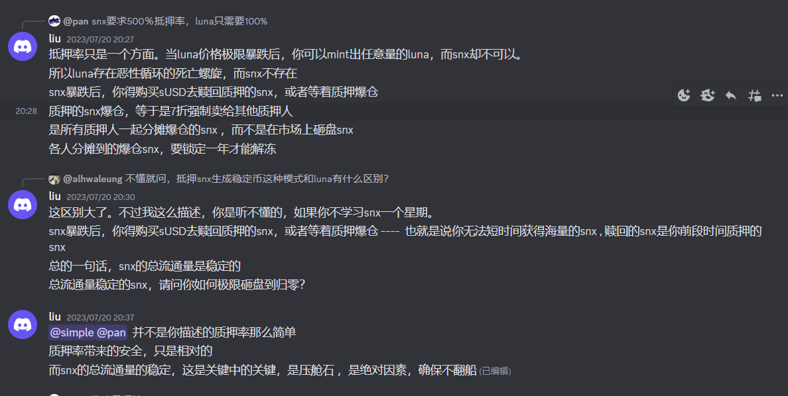

# GMX类

## GMX

- fork兴起的原因：tokennomics的包袱，1325万的gmx的一半给到了前投资人gambit & xvix，只有一半的代币做治理
- 老用户不愿意卖代币

syrup finance rug - 团队跑路 匿名仿盘的风险。

perp 对比分析：https://dune.com/shogun/perpetual-dexs-overview

---

# kwenta

Synthetix Perps 可以在与 SNX 流动性集成并支持 Perps 交易的前端进行交易：Kwenta、Polynomial 和 dHEDGE。主要是perps v2，snx生态的其他衍生品协议（如lyra、thales）都有自己的流动性lp，只是都使用susd而已

请注意，Synthetix perp不直接提供任何交易前端，而是依赖第三方面向用户的协议来为交易者提供服务。

为什么是"最深的流动性"？因为是债务池模式。掏空流动性的可能是trader大量集中并盈利，交易所用skew平衡风险敞口。

\$Kwenta的供应

---

# Synthetix stakers

https://docs.synthetix.io/staking/current-protocol-parameters

kwenta的流动性都是synthetix提供的，手续费也到了sxn的池子。

事实是，系统通过在抵押者铸造或销毁 sUSD 时向抵押者发行债务份额（代币）来跟踪债务池。质押者的债务百分比将是其代币余额除以债务份额的总供应量。

**赌场的维系做局方法是夸张的超额抵押：**

> 抵押品通常具有较高的波动性。超额抵押可以降低抵押不足的风险。如果抵押品价值下跌过多，系统将在触及最低要求之前清算抵押品并提前出售。
> 债务池通常具有较高的波动性。即使抵押资产价值稳定，也存在债务池总额增长过快、抵押不足的风险。

---

# Tokenomics

sUSD何以保持稳定？源自超额抵押。staker为最后的buyer，为了取回snx，staker必将要买回亏损的sUSD。
There are three ways to increase your C-Ratio:
    Burn some sUSD to clear some of your debt.
    Stake additional SNX.
    Wait for the price of SNX to increase.

---

# 盈亏汇总

## Trader

### Profit：

1. 合约盈亏，以sUSD结算，来源是mint/burn
2. 对手funding，每秒计算
3. 奖励计划(为鼓励trader来交易，根据手续费分得，非长期，不重要)

### Loss：

1. 执行费，支付给keeper，动态费用，2\$左右
2. maker/taker手续费 （2bp / 6bp），100%进入debt pool
3. funding，给对手。

---

## staker

### profit：

1. 债务池缩水(sToken总体下跌)
2. trader Loss（2）的手续费(不再发放，而是通过每周burn的形式减少债务)
3. SNX（抵押物）升值
4. 通胀奖励

### loss：

1. 债务池膨胀（sToken总体上涨）
2. SNX（抵押物）贬值 ：需要使质押价值维持在c-ratio（500%）
---

# Kwenta（integrators）

1. 通过[SIP2002](https://sips.synthetix.io/sips/sip-2002/)提案从synthetix获得SNX奖励。

# Keepers

Synthetix perps require keepers to automate 2 core area of functionality: delayed off-chain order executions, and liquidation.

---

# Q & A

q : 请问成为staker后我是否不仅成为kwenta的trader的对手盘，还会成为生态上其他协议的对手盘？
a : kwenta的trader的对手盘 首先是和他开相反方向的trader，如果没有相反方向的trader，那就是snx的staker.主要是perps v2，snx生态的其他衍生品协议（如lyra、thales）都有自己的流动性lp，只是都使用susd而已

q: spot exchange用的是什么资金池？
a: 也是snx staker做对手盘

q: 当一个btc多头交易者盈利时，在平仓时sUSD被mint出来支付给交易者，而亏损时保证金被burn，整个过程中并没有产生sBTC，这对吗？
a: perps不涉及mint和burn 纯记账.你就当作会计记账好了 sbtc其实本身也是一种记账单位

q: sUSD如何稳定？
a: sUSD通过套利机制维持价格锚定。sUSD的铸造价格始终为1美元，当市场价格高于铸造价格时，套利者可以铸造新的sUSD，按照市场价格卖出获利，市场供应增加，价格回落。当市场价格低于铸造价格时，套利者可以从市场买回sUSD，然后销毁sUSD，降低债务。

q： 那么从整体来看，如果trader整体盈利的话，trader总账户增加的sUSD是mint出来的吗，这会导致debt pool增大是吗？
a： 是的 会导致debt pool增大
    perps v2现在通过资金费率吸引套利者利用cex对冲来使得池子保持多空平衡的策略还是很成功的
    目前盈亏主要是在trader之前发生
    对于global debt pool（也就是snx staker）来说，总体没有承担太大的风险

