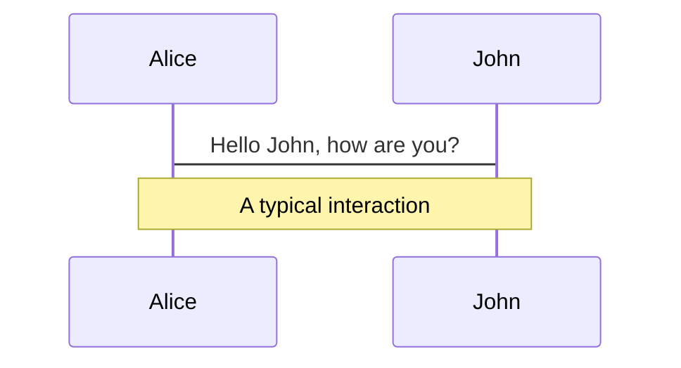
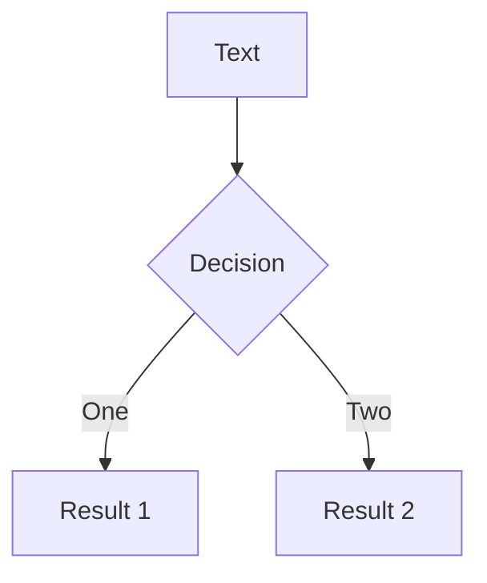

# debriefing report

  
    Press Space for next page <carbon:arrow-right class="inline"/>
  

<!--
The last comment block of each slide will be treated as slide notes. It will be visible and editable in Presenter Mode along with the slide. [Read more in the docs](https://sli.dev/guide/syntax.html#notes)
-->

---

# Content

- 📝 **Defi综述** - 反其道而行之

- 🦄 **Uniswap** - 初识流动性 

- 🐦 **Trader Joe** - 一个更简单的版本 
- 🌽 **对冲** - 从静态到动态
- 🚗 **总结与感想** 

 
 

<!--
You can have `style` tag in markdown to override the style for the current page.
Learn more: https://sli.dev/guide/syntax#embedded-styles
-->

---

# Dex做市

基于AMM的流动性提供

<!-- https://sli.dev/guide/syntax.html#line-highlighting -->

- Automated Market Maker - 自动做市机制
- Liquidity Provider - 成为庄家
- Profit：交易手续费
- Loss ： Impermanent Loss - AMM的天然弊端

---

# Joe

bins构建的离散流动性

- 双币种流动性
- 提高集中度，调整流动性区间区间
- 离散价格

---

# UniswapV3

- 集中流动性
- 更大的收益
- 更大的无常损失

  

---
class: px-30
---

# Hedgeing

AMM机制下，LP的行动是反趋势的，最大的损失IL在价格剧烈变动时会出现得不偿失的情况。

 

UniV3中，
$$
dx = (\frac{1}{\sqrt{p_1}} - \frac{1}{\sqrt{p_0}}) \times liq \\

dy = (\sqrt{p_1} - \sqrt{p_0}) \times liq \\ 
$$
这意味着价格从p0变化到p1，LP在这段价格上均匀地卖出了eth。

如果：
1. 我们一开始只有U，则价格上涨时我们的价值在上涨，下跌时我们的价值在下跌。
2. 我们一开始只有C，无论价格涨跌，我们的价值都在下降！
 

---
preload: false
---

# Spot Hedging

现货对冲的逻辑是在现货市场实时地将当前的敞口补平。然而在任何一段小的价格区间内，补偿口的操作的成交价格，总是比Uni上交换的平均价格更不利。

---

# LaTeX

LaTeX is supported out-of-box powered by [KaTeX](https://katex.org/).

 

Inline $\sqrt{3x-1}+(1+x)^2$

Block
$$
\begin{array}{c}

\nabla \times \vec{\mathbf{B}} -\, \frac1c\, \frac{\partial\vec{\mathbf{E}}}{\partial t} &
= \frac{4\pi}{c}\vec{\mathbf{j}}    \nabla \cdot \vec{\mathbf{E}} & = 4 \pi \rho \\

\nabla \times \vec{\mathbf{E}}\, +\, \frac1c\, \frac{\partial\vec{\mathbf{B}}}{\partial t} & = \vec{\mathbf{0}} \\

\nabla \cdot \vec{\mathbf{B}} & = 0

\end{array}
$$

 

[Learn more](https://sli.dev/guide/syntax#latex)

---

# Diagrams

You can create diagrams / graphs from textual descriptions, directly in your Markdown.

[Learn More](https://sli.dev/guide/syntax.html#diagrams)

---
layout: center
class: text-center
---

# Learn More

[Documentations](https://sli.dev) / [GitHub Repo](https://github.com/slidevjs/slidev)
